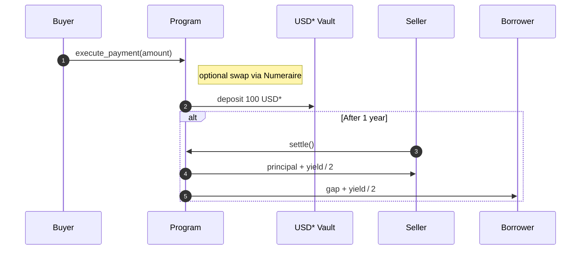

# FrontEraning Solana Program
---

This program implements **delayed settlement into instant discounts** using Perena's USD* basket and Numeraire AMM.

* *Buyer* pays with USD*/USDC/USDT, gets an immediate discount.
* *Seller* waits an agreed period (default 1 year) and receives the principal + half of the USD* yield.
* Borrower supplies the small "gap" capital(like 2 USD) locks for the same period, and later withdraws their principal + the other half or more of the yield.

## Overview



## Instructions

| # | Instruction | Caller | Purpose |
|---|-------------|--------|---------|
| 1 | **`init_config`** | Owner | One‑time bootstrap. Sets per‑token discount BPS and `settle_wait_secs`. |
| 2 | **`update_config`** | Owner | Update discount BPS or waiting period. |
| 3 | **`deposit_liquidity`** | Borrower | Deposit USDC/USDT/USD\*. Non‑USD\* coins are auto‑swapped to USD\* via Numeraire, then pooled for shares. |
| 4 | **`withdraw_liquidity`** | Borrower | Redeem unallocated shares for USD\* (+ accrued APY). |
| 5 | **`initialize_payment`** | Seller | List a product (`price` u64). Creates a `Payment` PDA (`status = Initialized`). |
| 6 | **`execute_payment`** | Buyer | Pay with discount. Pool automatically supplies the gap (`allocate_gap` internal CPI). `status = Funded`. |
| 7 | **`settle`** | Seller | After `settle_wait_secs`: Seller gets **principal + ½ yield**, participating borrowers get **gap + ½ yield**. `status = Settled`. |

> `allocate_gap` is internal; it’s invoked by `execute_payment` and never called directly.


## Flow

```mermaid
flowchart LR
  subgraph Off‑chain
    UI[Web / Mobile dApp]
    Cron[Backend Scheduler]
  end
  subgraph On‑chain (Anchor)
    P[Front‑Earning<br/>Program]
    Pool[(LiquidityPool)]
    VaultUSD*[(Vault USD*)]
    N{{Numeraire<br/>AMM}}
    Perena[[Perena<br/>Seed Pool]]
  end

  UI -- deposit_liquidity --> P
  P -- swap? --> N
  P -- mint shares --> Pool
  P -- deposit USD* --> VaultUSD*
  VaultUSD* -- stake --> Perena

  UI -- execute_payment --> P
  P -- allocate_gap --> Pool
  P -- goods off‑chain --> UI

  Cron -- settle_wait_secs --> P
  P -- payout principal+yield --> UI
  P -- payout gap+yield --> UI
```

## Build & Test

1. Before build

```sh
brew install rustup
rustup default stable
npm i -g @coral-xyz/anchor-cli
```

2. Build

```sh
anchor build
```

3. Local test

```sh
anchor test
```

4. Devnet deploy

```sh
anchor deploy --provider.cluster devnet --program-name front-earning-program
```

5. Verify

```sh
solana address -k target/deploy/front-earning-program-keypair.json
solana account <program-id>
```

### Notes
* The pool stakes all USD\* in Perena’s Seed Pool — base APY accrues automatically.
* Gap allocation is **FIFO**; rounding error is ≤ 1 lamport.
* If the pool lacks liquidity for the requested discount, `execute_payment` fails with `GapTooLarge`.